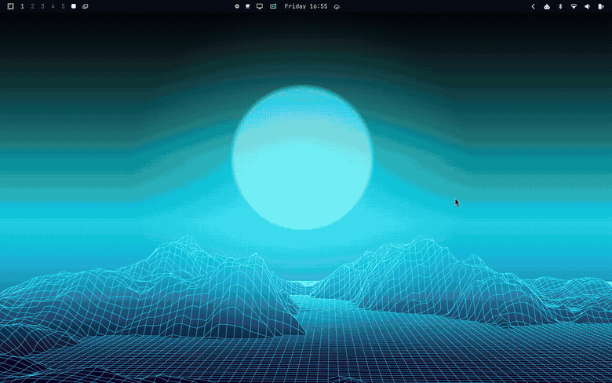
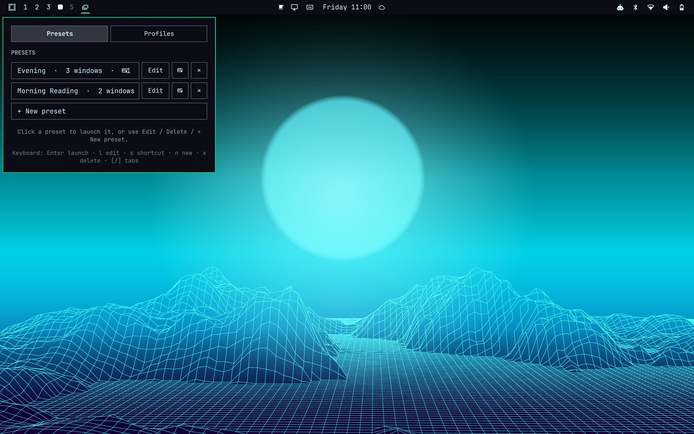
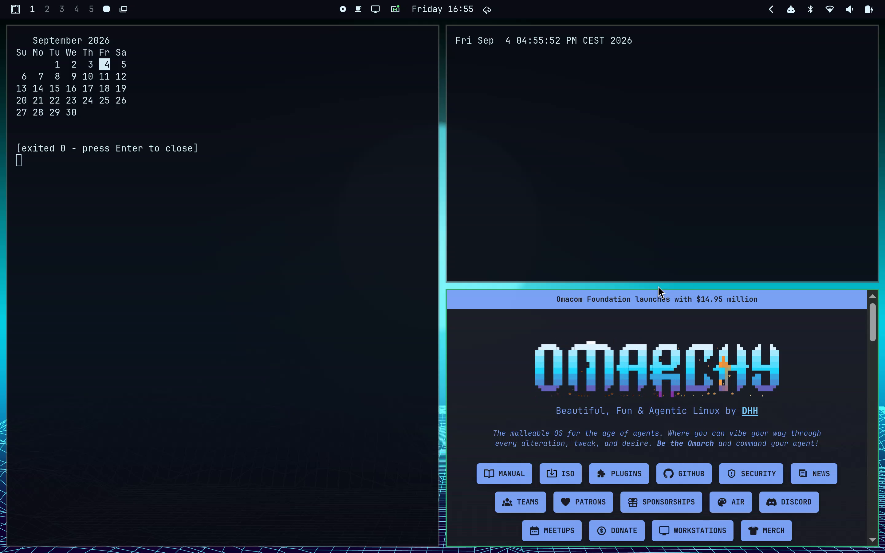
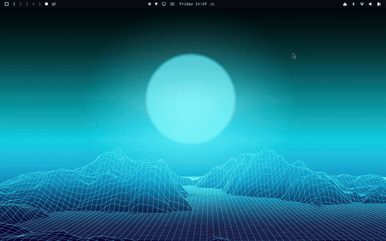
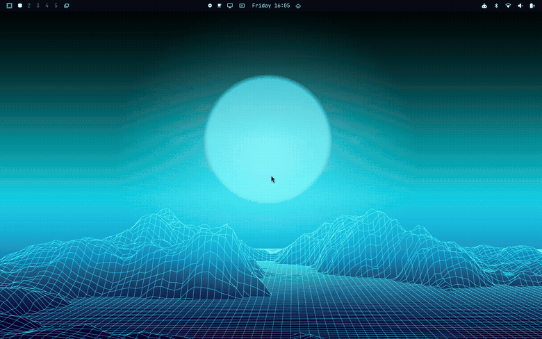

# Presets for Omarchy

Launch a saved set of windows from the Omarchy bar, or build a profile that
sets up several workspaces at once. Presets can also be assigned to numbered
keyboard shortcuts, and one profile can optionally run when Omarchy starts.



## What it does

- Saves ordered groups of terminal commands, web apps, and custom commands.
- Opens windows in Omarchy's scrolling layout and preserves their configured
  left-to-right order.
- Maps presets to workspaces in reusable profiles.
- Shows live progress while a profile launches.
- Offers nine quick-launch slots for presets and nine for profiles.
- Can run one explicitly selected default profile after login.
- Stores everything as readable JSON outside the plugin directory.

<table>
<tr>
<td></td>
<td></td>
</tr>
</table>

## Requirements

Presets requires the Quickshell-based Omarchy shell and the `omarchy plugin`
and `omarchy hook` commands. It has been tested with:

- Omarchy 4.0.2
- Quickshell 0.3.1
- Hyprland 0.56.2

There are no extra package dependencies beyond a current Omarchy install. The
plugin uses tools Omarchy already provides or depends on: Bash, `jq`, `luac`,
`hyprctl`, `omarchy-launch-terminal`, `omarchy-launch-webapp`, and
`omarchy-notification-send`. Applications and commands saved in your presets
are, naturally, your responsibility.

## Install

```bash
omarchy plugin add https://github.com/Kyotroo/omarchy-workspace-profiles.git
omarchy plugin enable kdm.presets --section left --after omarchy.workspaces
```

The second command places Presets in the left side of the bar, immediately
after Workspaces. Open it by clicking the bar icon.



### First run and configuration consent

On first open, Presets asks whether it may add its quick-launch bindings to
`~/.config/hypr/bindings.lua`. Accepting appends one clearly marked block. It
first makes a temporary backup, checks the result with `luac`, reloads
Hyprland, and restores the original file if either validation step fails.
Declining leaves the file untouched.

The post-boot hook is separate: it is installed only when you explicitly mark
a profile as the default. Its path is:

```text
~/.config/omarchy/hooks/post-boot.d/kdm-presets-activate-default-profile.sh
```

## Quick start

1. Open Presets and choose **New preset** (`n`).
2. Open the preset, choose **Add window** (`a`), and add any combination of:
   - **Terminal** — a command opened in a terminal, such as `btop`.
   - **Web app** — an installed Omarchy web app or a custom URL such as
     `https://omarchy.org`.
   - **Custom** — any shell command, run as your user.
3. Reorder entries with `Shift+J` / `Shift+K`; this controls their
   left-to-right order.
4. Press `Enter` on the preset to launch it.


### Preset controls

| Key | Action |
| --- | --- |
| `↑` / `↓` or `j` / `k` | Move selection |
| `Enter` / `Space` | Launch selected preset |
| `→` / `l` | Edit selected preset |
| `n` | Create preset |
| `a` | Add a window while editing |
| `Shift+J` / `Shift+K` | Move a window later / earlier |
| `s` | Assign a preset shortcut slot |
| `x` | Delete selected preset or window |
| `[` / `]` | Switch between Presets and Profiles |
| `Esc` | Go back or close the panel |

Terminal and Custom entries can have an optional display title. Installed web
apps use the title from their desktop entry automatically.

## Profiles

A profile maps workspace numbers to presets. For example, workspace 2 can open
a Reading preset while workspace 3 opens an Evening preset. Create a profile
from the **Profiles** tab, add each workspace/preset pair, then choose what
happens to windows already on those workspaces.



| Close mode | Behavior |
| --- | --- |
| **Close ours only** | Closes only windows tracked from the profile's previous run; manually opened windows stay. This is the default. |
| **Close all on workspace** | Closes every window on each target workspace. |
| **Keep existing** | Leaves all existing windows and adds the new ones. |

Activating a profile shows a live pending/done list. Press `d` in a profile's
edit view to make it the login default. Only one profile can be default at a
time; that explicit action also installs the plugin-specific post-boot hook.
If you ever need to reinstall the hook manually, run:

```bash
omarchy hook install post-boot ~/.config/omarchy/plugins/kdm.presets/hooks/kdm-presets-activate-default-profile.sh
```

## Keyboard shortcuts

After accepting first-run shortcut setup, assign numbered slots with `s` or
the keyboard button on a row:

- `SUPER + CTRL + SHIFT + 1` through `9` launch preset slots.
- `SUPER + CTRL + ALT + 1` through `9` launch profile slots and open the live
  progress panel.

If you declined onboarding, add this block to
`~/.config/hypr/bindings.lua` manually:

```lua
-- kdm.presets quick-launch shortcut slots
for slot = 1, 9 do
  o.bind("SUPER + CTRL + SHIFT + code:" .. tostring(slot + 9), "Preset slot " .. slot,
    "omarchy-shell kdm.presets activatePresetSlot " .. slot)
  o.bind("SUPER + CTRL + ALT + code:" .. tostring(slot + 9), "Profile slot " .. slot,
    "omarchy-shell kdm.presets activateProfileSlot " .. slot)
end
```

The physical key codes are intentional: shifted number keys produce different
characters on many keyboard layouts.

To open or close the panel with `SUPER + SHIFT + Q`, add this optional binding
to `~/.config/hypr/bindings.lua`:

```lua
o.bind("SUPER + SHIFT + Q", "Presets", "omarchy-shell shell toggle kdm.presets")
```

## Data, commands, and permissions

Presets runs entirely as your user and makes no network requests of its own.
Web apps and custom commands you configure may use the network.

Its own state lives under `~/.local/state/omarchy/kdm-presets/`:

| File | Purpose |
| --- | --- |
| `presets.json` | Preset names and ordered window definitions |
| `profiles.json` | Profile workspace mappings, close modes, and default flag |
| `shortcuts.json` | Numbered shortcut assignments |
| `active-profile.json` | Windows opened by the latest profile run |
| `activation-progress.json` | Current profile-launch progress |
| `onboarding.json` / `onboarding-result.json` | First-run status |

Writes are atomic: each JSON update is written to a sibling temporary file and
renamed into place. The plugin may also make these user-approved configuration
changes:

- append the marked shortcut block to `~/.config/hypr/bindings.lua` after the
  onboarding prompt is accepted;
- install its named post-boot hook after a profile is explicitly made default;
- set target workspaces to Hyprland's scrolling layout when launching;
- close windows according to the profile close mode you selected.

Custom entries are shell commands. Only save commands you trust.

### Example formats

`presets.json`:

```json
[
  {
    "name": "Evening",
    "windows": [
      { "type": "terminal", "value": "cal", "label": "Calendar" },
      { "type": "webapp", "value": "https://omarchy.org", "label": "Omarchy" }
    ]
  }
]
```

`profiles.json`:

```json
[
  {
    "name": "Daily Setup",
    "default": false,
    "closeMode": "trackedOnly",
    "workspaces": [
      { "workspace": 2, "preset": "Reading" },
      { "workspace": 3, "preset": "Evening" }
    ]
  }
]
```

## Remove

Disable the widget, remove its post-boot hook, then remove the plugin:

```bash
omarchy plugin disable kdm.presets
rm -f -- ~/.config/omarchy/hooks/post-boot.d/kdm-presets-activate-default-profile.sh
omarchy plugin remove kdm.presets --yes
```

If you accepted shortcut setup, also delete the marked `kdm.presets
quick-launch shortcut slots` block from `~/.config/hypr/bindings.lua`, then run
`hyprctl reload`.

Plugin state is deliberately preserved when the plugin is removed. Delete it
only if you do not want to reinstall or keep your presets:

```bash
rm -rf -- ~/.local/state/omarchy/kdm-presets
```

## License

[MIT](LICENSE) © kdm
